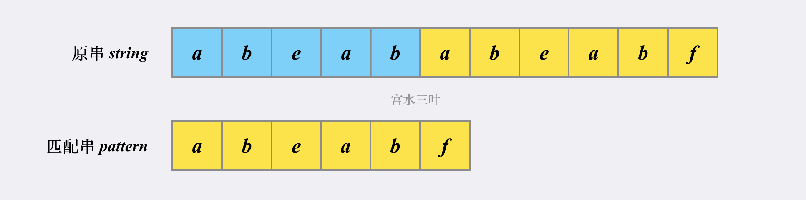
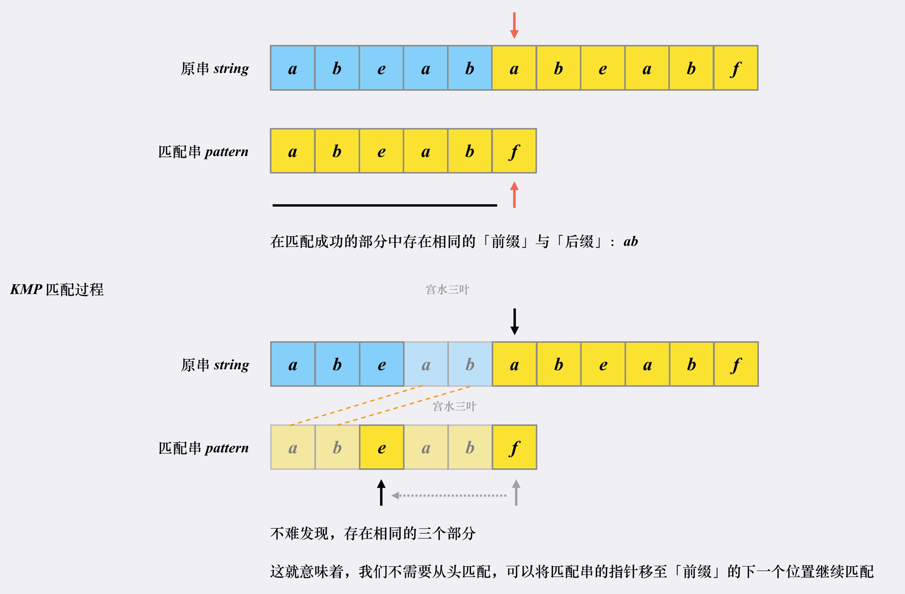
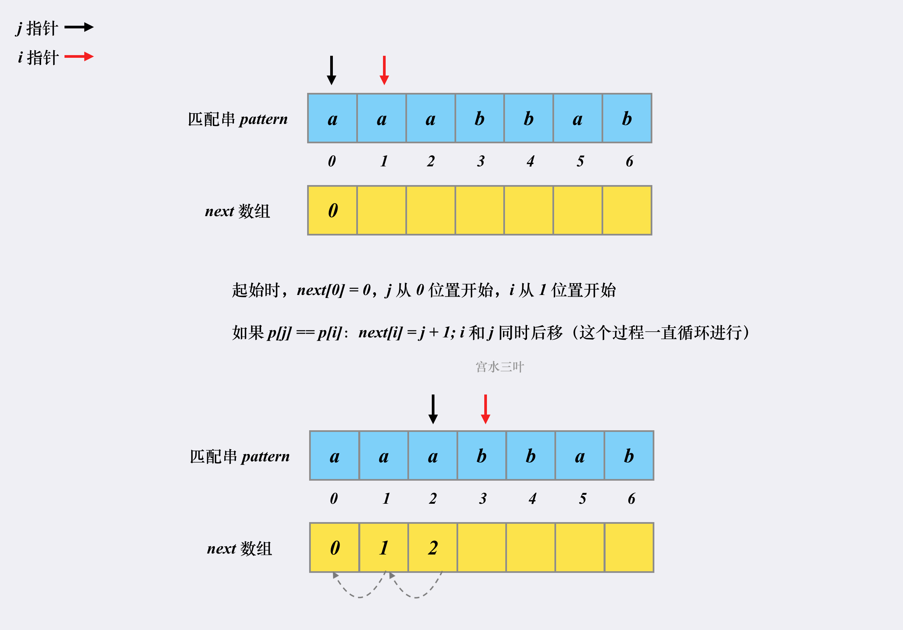

# KMP

- [28. Find the Index of the First Occurrence in a String](https://leetcode.cn/problems/find-the-index-of-the-first-occurrence-in-a-string/)

## Brute Force

- $O(m*n)$

```ts
function strStr(haystack: string, needle: string): number {
    outer: for (let i = 0; i <= haystack.length - needle.length; i++) {
        for (let j = 0; j < needle.length; j++) {
            if (haystack[i + j] !== needle[j]) {
                continue outer;
            }
        }
        return i;
    }
    return -1;
};
```

## KMP

### 思路

- $O(m+n)$
- **KMP 利用已匹配部分中相同的「前缀」和「后缀」来加速下一次的匹配**
- **KMP 的原串指针不会进行回溯（没有朴素匹配中回到下一个「发起点」的过程）**




### next 数组

- $O(m)$




