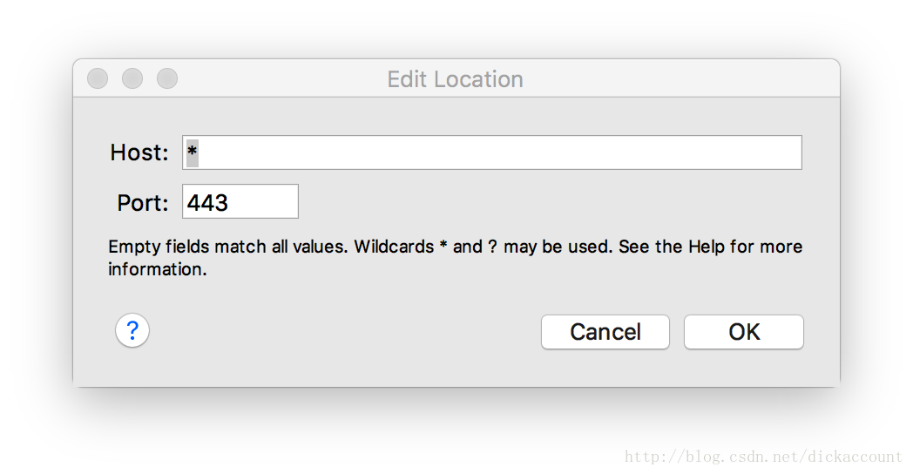

> [charlesproxy](https://www.charlesproxy.com/)

# certificate

- 安装证书 `Help/SSL Proxying/Install Charles Root Certificate`
- 信任证书(自定义证书默认不受信任) `钥匙串/证书/信任/使用此证书时(始终信任)`

# SSL Proxying

- `Proxy/SSL Proxying Settings`
- `Shift + Command + l`
- Enable SSL Proxying
- Include

# breakpoints

- `Proxy/Breakpoint Settings`
- `Shift + Command + k`
- url右键`Breakpoints`